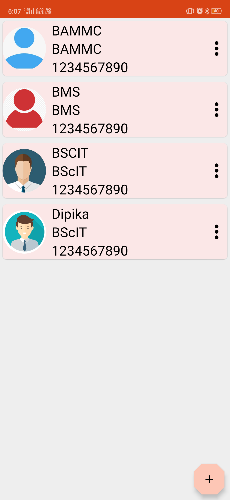

# College Management App

The College Management App is a comprehensive application designed to simplify administrative and academic tasks within a college or educational institution. It offers features including attendance management, event management, class management, admin control, student login, teacher login, and much more.
# Screenshots
<table>
<tr>
<td></td>
<td></td>
</tr>
</table>

### Student
<table>
<tr>
<td>
<td>
<td></td>
</tr>
</table>
<table>
<tr>
<td></td>
<td></td>
<td></td>
</tr>
</table>
<table>
<tr>
<td></td>
<td></td>
</tr>
</table>

### Teacher
<table>
<tr>
<td>
<td>
<td></td>
</tr>
</table>
<table>
<tr>
<td></td>
<td></td>
<td></td>
</tr>
</table>
<table>
<tr>
<td></td>
<td></td>
<td></td>
</tr>
</table>
<table>
<tr>
<td></td>
</tr>
</table>

### Admin
<table>
<tr>
<td>
<td>
<td></td>
</tr>
</table>
<table>
<tr>
<td></td>
<td></td>
<td></td>
</tr>
</table>

## Features

### Attendance Management
- Allows teachers to take and manage attendance for their classes.
- Provides insights into student attendance records.

### Event Management
- Enables the scheduling and management of events and activities within the college.

### Class Management
- Facilitates the organization of classes, including class scheduling and room assignments.

### Admin Control
- Admins have control over users, timetables, notices, and events.
- Can add or delete classes, teachers, students, and more.

### Student Login
- Students can access their attendance records and other information.

### Teacher Login
- Teachers can take attendance, upload notes and assignments, and manage their classes.

### Notes and Assignments
- Teachers can upload study materials and assignments for students.

### Timetable Management
- Admins can create and manage class timetables.

### Notice Management
- Admins can post important notices for students and teachers.

## Installation

Provide instructions on how to install and run your College Management App. Include any dependencies and setup steps.

## Contact

Gmail - harshitgoswami103@gmail.com
